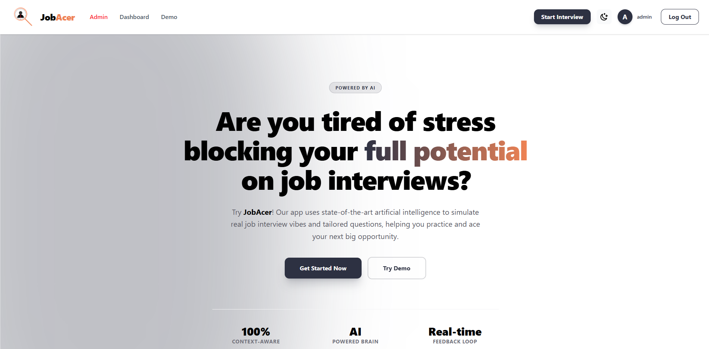
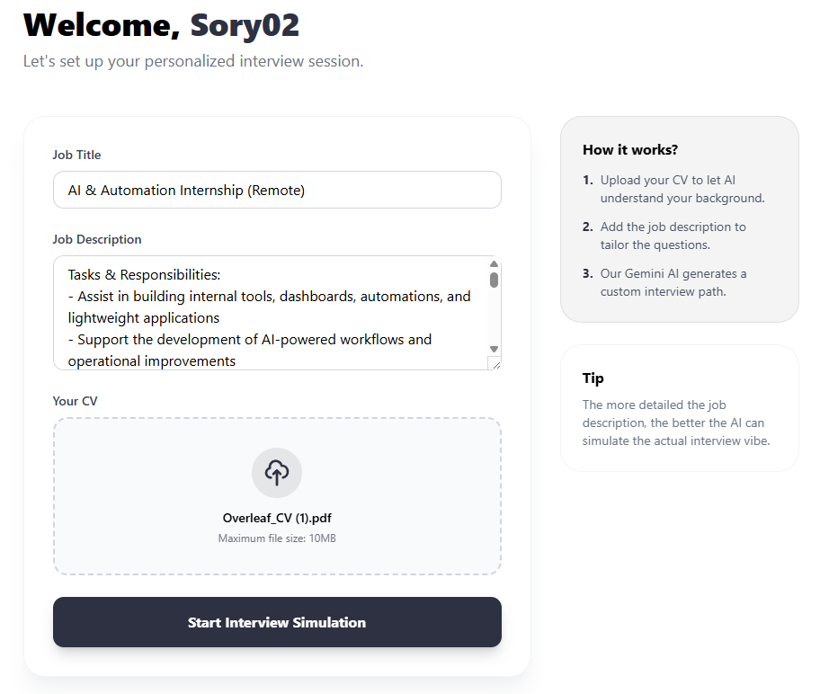
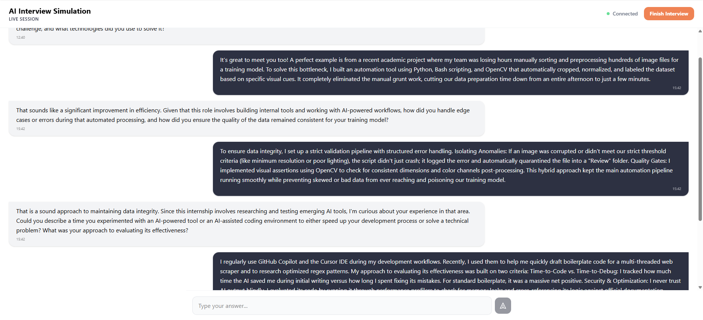
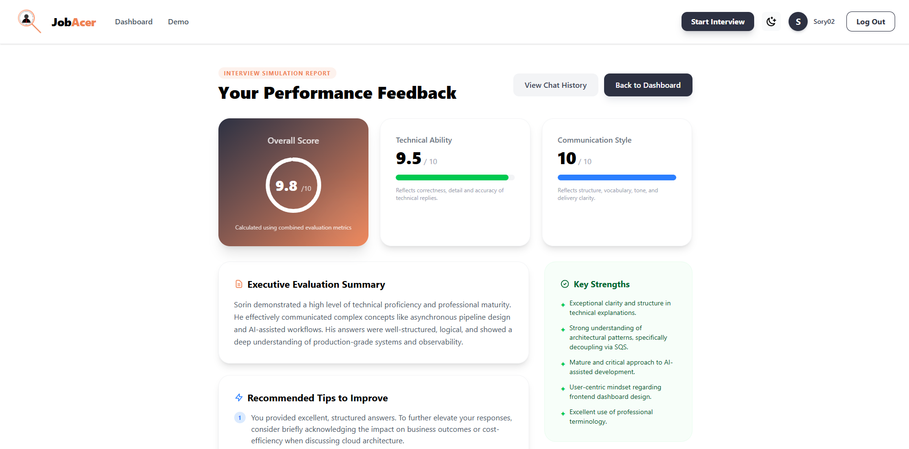
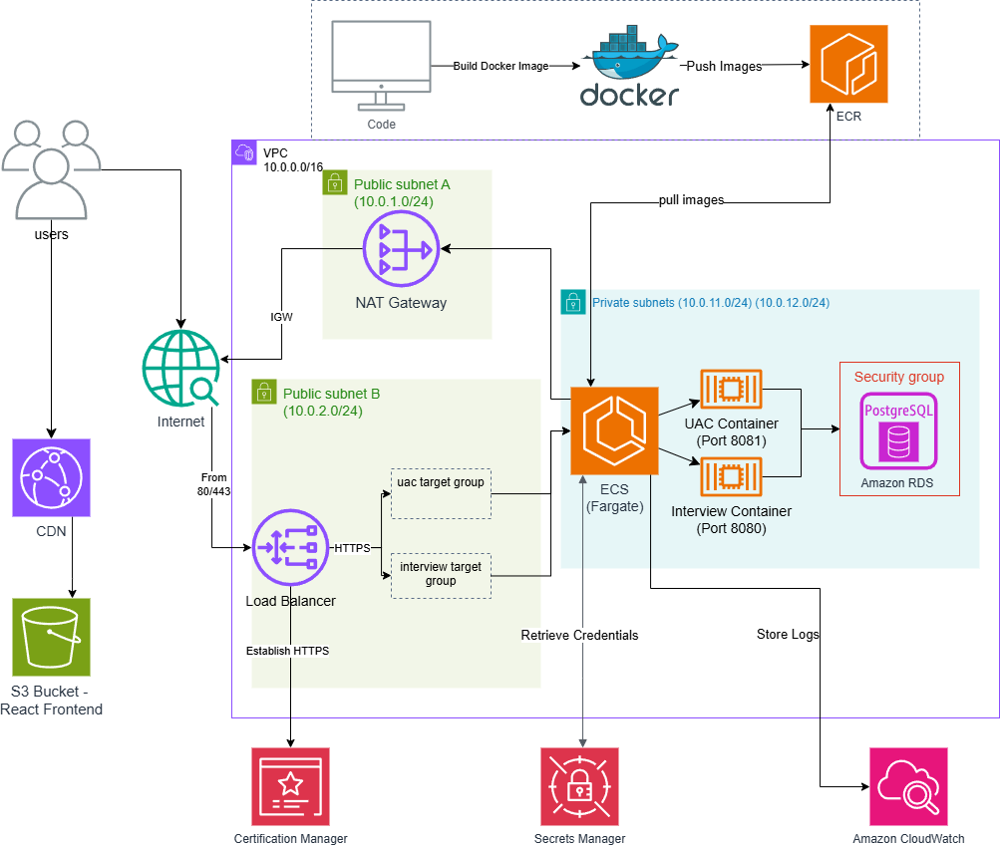
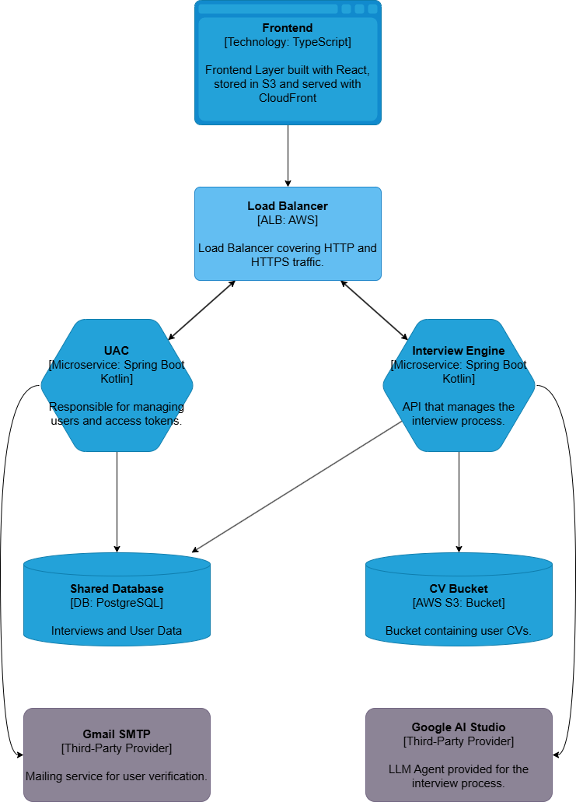

# AI Interview Platform

An AI-powered cloud platform that simulates technical interviews and automatically evaluates candidates using Large Language Models (LLMs).

The platform allows users to upload their CV, select a target role and seniority level, and participate in an interactive interview session generated by AI. At the end of the interview, users receive a structured feedback report containing strengths, weaknesses, suggested improvements, and an overall score.

## Features

- JWT authentication and role-based authorization
- PDF CV upload and semantic text extraction
- AI-generated technical interviews using Google Gemini/OpenAI models
- Real-time chat interface
- Automated candidate evaluation and feedback generation
- User dashboard with interview history
- Prompt injection protection and rate limiting
- Admin dashboard with platform metrics and monitoring
- Fully deployed cloud infrastructure on AWS

## Architecture

The application follows a distributed microservices architecture:

- **UAC Service** – authentication and authorization
- **Interview Service** – interview orchestration and AI integration
- **Frontend SPA** – user interface and real-time interaction

## Tech Stack

### Backend
- Kotlin
- Spring Boot 3
- Spring Security
- Spring AI
- JPA / Hibernate
- PostgreSQL
- JWT Authentication

### Frontend
- React 19
- TypeScript
- Material UI
- Vite

### Cloud & DevOps
- Docker
- AWS ECS Fargate
- AWS RDS PostgreSQL
- AWS S3 + CloudFront
- Terraform
- GitHub Actions

## AI Features

- Dynamic interview generation based on:
  - Candidate CV
  - Target job role
  - Seniority level

- Structured evaluation using LLMs:
  - Technical score
  - Strengths and weaknesses
  - Improvement suggestions
  - Detailed feedback report

## Why I built this project

I wanted to combine modern cloud-native software engineering with generative AI to create a practical tool that helps software engineers prepare for technical interviews while exploring real-world challenges such as:

- LLM integration in production systems
- Secure AI application design
- Distributed systems and microservices
- Cloud infrastructure automation
- Scalable full-stack development

## Screenshots

### Main Page

### Interview Setup

### Interview Process

### Feedback Report

### Cloud Architecture

### Microservices

## Demo
#### If the app is deployed at the moment, it is accesible at https://jobacer.sorinnoroc.com
#### Otherwise, please contact me to provide a demo of the app or to start it.